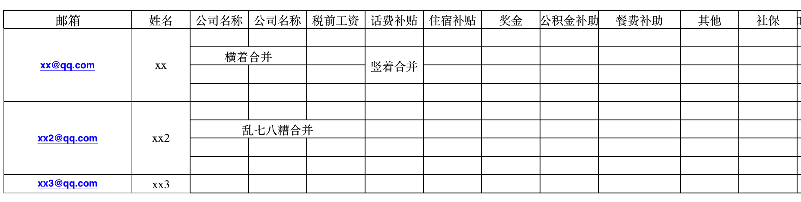

### 工资条发邮件程序
按照excel中的工资条发邮件

### 配置
1. 安装python依赖

   ```
   pip install openpyxl
   ```

2. 在config.ini配置发送人相关信息。例如用腾讯企业邮箱发送，则参照[文档](http://service.exmail.qq.com/cgi-bin/help?id=28&no=1000585&subtype=1)，配置为

   邮件发送服务器smtp.exmail.qq.com，端口号465，使用SSL。

3. 在data.xlsx填入员工工资信息。对excel文件的要求：**第一行为标题，第一列为邮箱**

### 发送邮件
```
python send_email.py
```


##### update log

2018.02.07：已支持合并单元格



